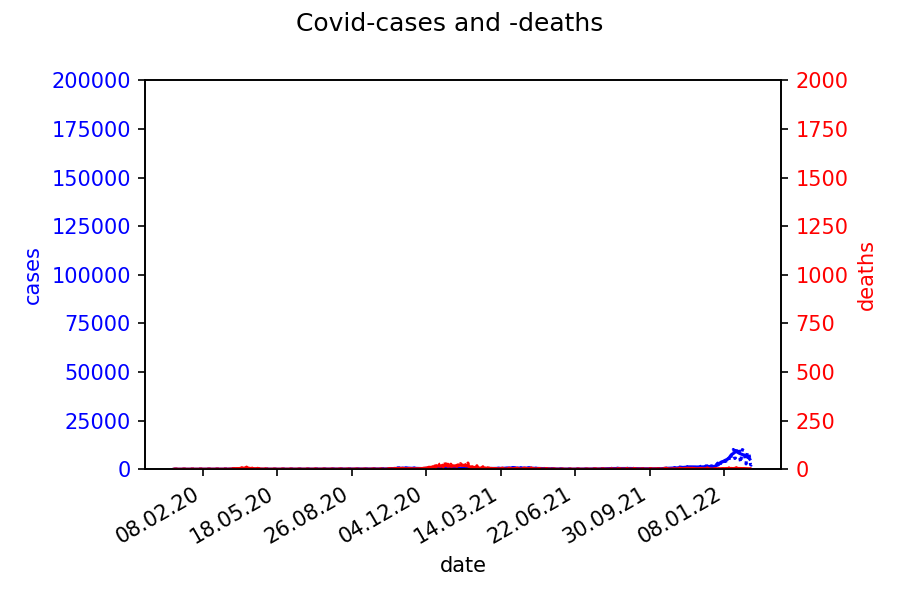
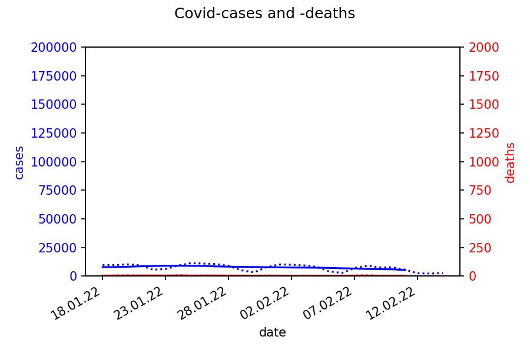
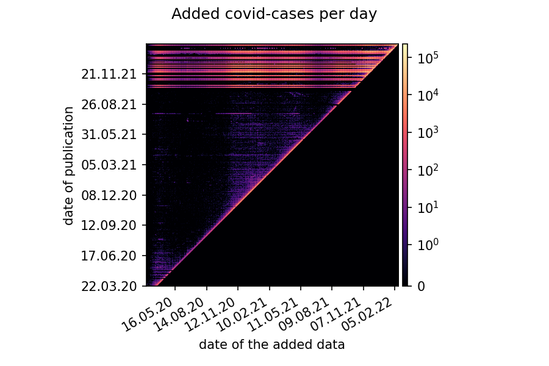
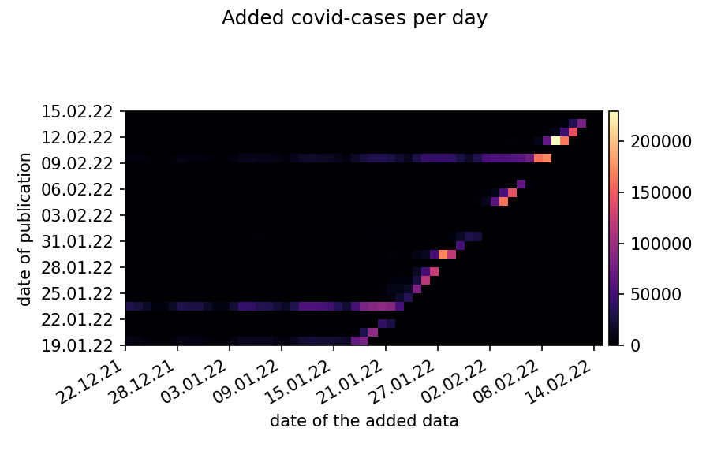
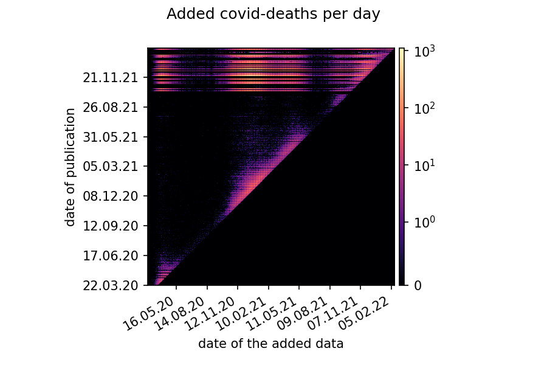
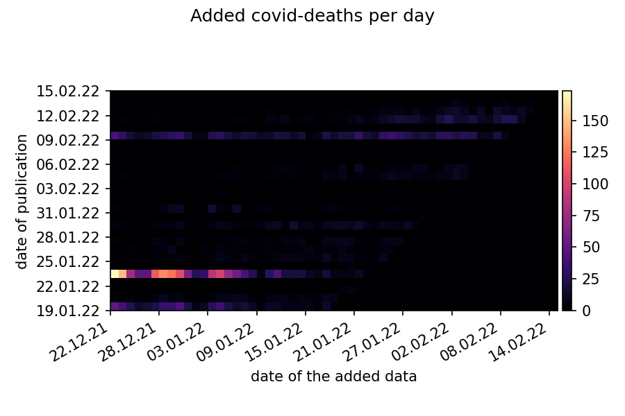

Dieses Repository enthält ausgewählte Covid-Daten des RKI in einem einfachen Format und wird täglich aktualisiert.

Die Daten sind in tägliche Neuinfektionen (cases) und Todesfälle (deaths) pro Landkreis aufgeteilt.

*See below for an English description.*

### Datenformat

Die `.csv` Dateien in `cases` und `deaths` enthalten je eine Matrix mit `402` Zeilen und `anzahl-der-tage+1` Spalten. Die erste Zeile und erste Spalte dienen als Überschriften.
Die erste Zeile enthält ab der zweiten Spalte das Datum als Zahl (Python `date(...).toordinal()`) vom 1. Jan. 2020 bis zum Dateidatum.
Die erste Spalte enthält ab der zweiten Zeile den [Amtlichen Gemeindeschlüssel (AGS)](https://de.wikipedia.org/wiki/Amtlicher_Gemeindeschl%C3%BCssel) (nur Bundesland und Landkreis).

Dateiformat:

    0,737060,737061,...
    1001,value-for-first-day-for-1001,value-for-second-day-for-1001,...
    ...
    16077,value-for-first-day-for-16077,value-for-second-day-for-16077,...

### Warum mehrere Dateien
Wenn immer nur die Daten für den aktuellen Tag hinzugefüht würden, wäre nur eine Datei nötig. Das RKI veröffentlicht jedoch nicht nur Daten für den aktuellen Tag sondern aktualisiert auch vergangene Tage. Deshalb unterscheiden sich die Dateien in mehr als der letzten Spalte.

### Aktuelle Daten

gesamter Covid-Verlauf | Covid-Verlauf des letzten Monats
-|-
 | 

gesamte Übermittlungsverzögerung | Übermittlungsverzögerung des letzten Monats
-|-
 | 
 | 

Die unteren 4 Diagramme zeigen die Übermittlungsverzögerung der RKI-Daten. Diese beschreibt die Verzögerung vom Tag des Bekanntwerden eines (Todes-)Falles bis zum Tag der Veröffentlichung durch das RKI. Bei den Covid-Fällen beträgt die Verzögerung fast immer weniger als 3 Tage, während sie bei den Covid-Todesfällen oft mehrere Wochen beträgt.

### Quellen

Datenquelle: Robert Koch-Institut (RKI), [dl-de/by-2-0](https://www.govdata.de/dl-de/by-2-0)

Die Daten bis Jan. 2021 sind von https://github.com/micb25/RKI_COVID19_DATA.

Neue Daten werden einmal täglich vom RKI heruntergeladen und aktualisiert.

# English Description

This repository contains parsed Covid-Data from the RKI in a simple format and is updated daily.

The data is split in daily new cases and deaths per county.

### Data Format

The `.csv` files in `cases` and `deaths` contain a matrix with `402` rows and `number-of-days+1` columns. The first row and first column are headers.
The first row contains the ordinal dates (Python `date(...).toordinal()`) from 2020-01-01 until the date of the file, starting at the second column.
The first column contains the German [County Identification Numbers (AGS)](https://de.wikipedia.org/wiki/Amtlicher_Gemeindeschl%C3%BCssel) (federal state and county only), starting at the second row.

data format:

    0,737060,737061,...
    1001,value-for-first-day-for-1001,value-for-second-day-for-1001,...
    ...
    16077,value-for-first-day-for-16077,value-for-second-day-for-16077,...

### Why multiple files

The RKI publishes not only data for the current day but also updates the previous days. Therefore the files differ in more than the last column.

### Current data

complete covid-history | covid-history of the last month
-|-
 | 

gesamte Übermittlungsverzögerung | Übermittlungsverzögerung des letzten Monats
-|-
 | 
 | 

The last 4 diagrams show the publication delay of the RKI-data. It describes the delay between the day of identification of the death/case until the day of publication by the RKI. For covid-cases the dalay nearly always below 3 days, while for the covid-deaths it's mostly several weeks.

### Data Sources

Data Source: Robert Koch-Institut (RKI), [dl-de/by-2-0](https://www.govdata.de/dl-de/by-2-0)

Data until Jan. 2021 is from https://github.com/micb25/RKI_COVID19_DATA.

New Data is downloaded from the RKI and parsed once every day.
